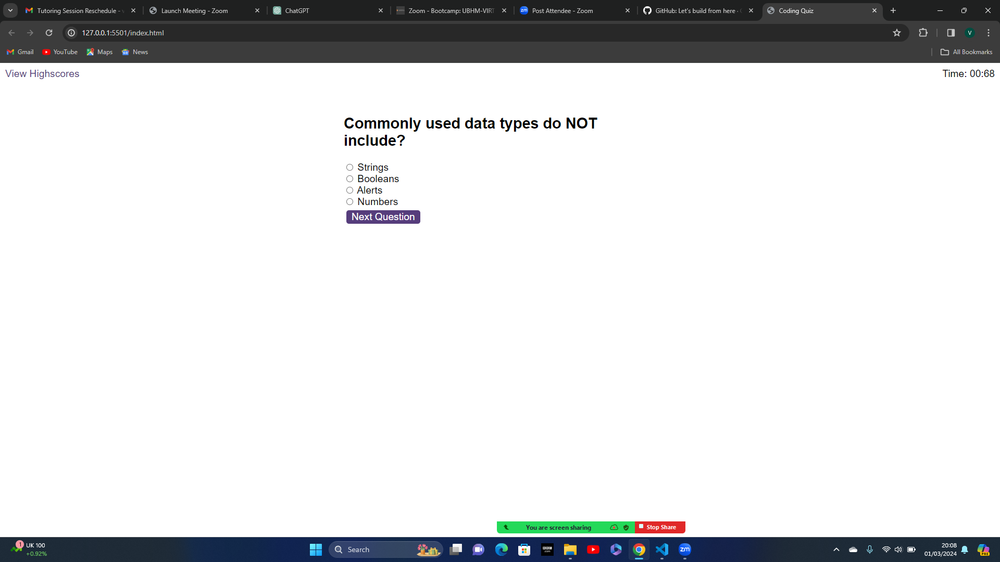

# Assignment to create a timed Code Quiz

## This is a quiz with JavaScript related questions that uses HTML, CSS and vanilla JavaScript to provide functionality 

## 
* Timer
* Deduct time for wrong answers
* Add to score for right answers 

## Screenshot:

 

## Link to deployed application:

https://vickycowell4.github.io/code-quiz/ 